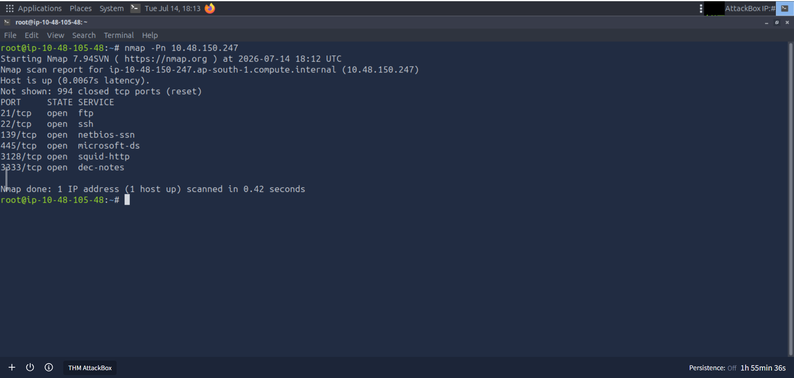
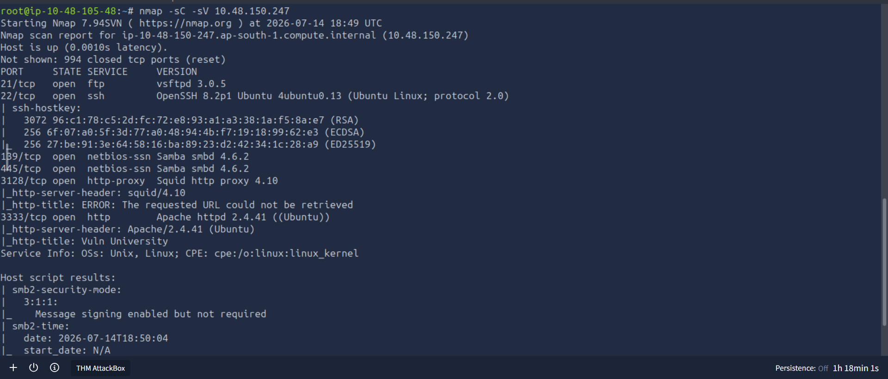
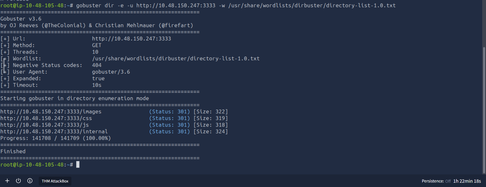

# Vulnversity Report

## Executive Summary
This report documents the security assessment performed against the TryHackMe Vulnversity machine. The assessment followed the standard penetration testing methodology of reconnaissance, enumeration, exploitation, and privilege escalation. Multiple services were identified, web content was enumerated, file upload restrictions were analyzed using Burp Suite, and an unrestricted file upload vulnerability was identified.


## Scope
- Platform: TryHackMe
- Room: Vulnversity
- Objective: Obtain initial access and escalate privileges while documenting every phase of the assessment.

## Methodology
The assessment followed the following:
1.Reconnaissance
2.Enumeration
3.Exploitation 
4.Privilege Escalation
6.Remediation

### 1. Reconnaissance

### Objective
Identify open ports and exposed network services on the target machine.

### Command Used

```bash
nmap -Pn <TARGET_IP>
```


### Findings

The Nmap scan identified six open TCP ports:

| Port | Service         | Purpose |
|------|-----------------|---------|
| 21   | FTP             | File Transfer Protocol |
| 22   | SSH             |  Secure Shell remote access |
| 139  | NetBIOS-SSN     | SMB/Windows file sharing |
| 445  | Microsoft-DS    | SMB file sharing |
| 3128 | Squid HTTP Proxy| Web proxy service |
| 3333 | DEC Notes       | Additional network service requiring further enumeration |

### Analysis

The scan revealed multiple exposed services that could provide potential attack vectors. FTP and SMB services may allow anonymous access or misconfigurations, while the Squid proxy and other services should be investigated further during the enumeration phase.
### 2. Enumeration

### Objective
Identify service versions and gather additional information about the exposed services.

### Command Used

```bash
nmap -sC -sV <TARGET_IP>
```


### Findings

Service detection identified the following services:

| Port | Service    | Version |
|------|------------|---------|
| 21   | FTP        | vsftpd 3.0.5 |
| 22   | SSH        | OpenSSH 8.2p1 |
| 139  | SMB        | Samba smbd 4.6.2 |
| 445  | SMB        | Samba smbd 4.6.2 |
| 3128 | HTTP Proxy | Squid Proxy 4.10 |
| 3333 | HTTP       | Apache httpd 2.4.41 |

### Analysis

The service detection scan provided version information for each exposed service. The HTTP service on port 3333 and the SMB services on ports 139 and 445 were identified as key targets for further enumeration. Additional testing was planned to identify potential vulnerabilities or misconfigurations.
### Web Directory Enumeration

#### Objective
Discover hidden directories and web resources that are not directly linked from the web application.

#### Command Used

```bash
gobuster dir -e -u http://<TARGET_IP>:3333 -w /usr/share/wordlists/dirbuster/directory-list-1.0.txt
```

#### Findings

The directory enumeration identified several accessible directories:

| Directory | HTTP Status |
|-----------|-------------|
| /images   | 301 Moved Permanently |
| /css      | 301 Moved Permanently |
| /internal | 301 Moved Permanently |

#### Analysis

The discovery of the `/internal` directory was particularly significant because it indicated the presence of content not intended for direct navigation. This directory was selected for further investigation as a potential entry point into the target system.

### File Upload Extension Testing

#### Objective
Determine which PHP file extensions are accepted by the application's upload filter.

#### Tool Used
- Burp Suite Intruder

#### Method
The file upload request was intercepted and sent to Burp Suite Intruder. A list of common PHP extensions was tested to identify which extensions bypassed the upload restrictions.
The following extensions were tested:
 -.php
 -.php3
 -.php4
 -.php5
 -.phtml

#### Outcome
The Intruder attack identified differences in server responses, indicating that certain PHP extensions were handled differently by the application. This information was used to select an extension for uploading a PHP reverse shell during the exploitation phase.
The **.phtml** extensionsuccessfully bypassed the upload restriction.

### 3. Exploitation

## Vulnerability

Unrestricted File Upload

## Description

The application allowed executable PHP content to be uploaded using the *.phtml* extension.

A PHP reverse shell payload was uploaded to the server.

## Commands

bash
nc -lvnp 1234

The payload was configured with the attack machine IP address and listening port before upload.

### 4. Privilege Escalation
After obtaining shell access, local enumeration was performed to identify privilege escalation vectors.

Commands such as:

bash
find / -perm -4000 2>/dev/null


were used to identify binaries with the SUID permission.

Misconfigured SUID binaries can allow privilege escalation to the root user.

## Tools Used
- Nmap
- Gobuster
- Burp Suite
- Netcat
- Python
- PHP Reverse Shell
- Linux Terminal

## Key Skills Demonstrated
- Network Reconnaissance
- Service Enumeration
- Directory Enumeration
- File Upload Testing
- Burp Suite Intruder
- Reverse Shell Deployment
- Linux Enumeration
- Privilege escalation
- Technical Reporting

## Lessons Learned
This lab reinforced the importance of systematic enumeration before exploitation. Multiple reconnaissance techniques revealed hidden attack surfaces, while Burp Suite demonstrated how upload filters can be bypassed through alternative PHP extensions. The exercise also highlighted the importance of proper file upload validation and secure server configuration.
