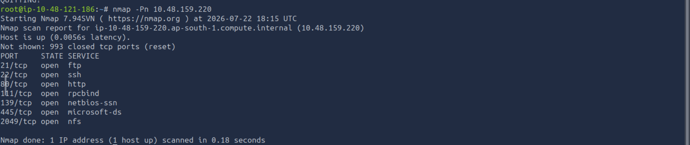
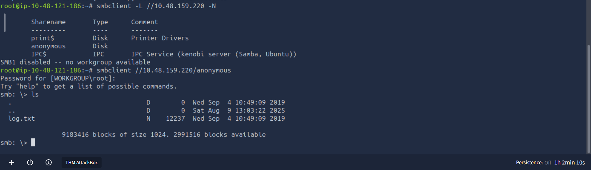

# Kenobi Penetration Testing Report
## Executive Summary
This report documents the assessment of the TryHackMe Kenobi room.
The objective was to identify vulnerabilities, gain initial access,
escalate privileges, and document the findings.

## Scope
- Target: TryHackMe Kenobi
- Platform: TryHackMe
- Difficulty: Easy

## Reconnaissance
### Nmap scan
An initial Nmap scan was performed to identify open ports and running services.
**Command:**

 ```bash
 nmap -Pn <TARGET_IP>
 ```

 ### Open ports
|PORT  |    STATE |   SERVICE         |
|------|----------|-------------------|
|21    |    open  |    ftp            |
|22    |    open  |    ssh            |
|80    |    open  |    http           |
|111   |    open  |    rpcbind        |
|139   |    open  |    netbios-ssn    |
|445   |    open  |    microsoft-ds   |
|2049  |     open |    nfs            |

 **Screenshot.**
 
 
 ### Analysis
 The initial Nmap scan identified seven
 open ports on the target system.The 
 presence of FTP,SSH,HTTP,SMB(NetBIOS/
 Microsoft-DS), RPCBind, and NFS suggested 
 multiple services that required further enumeration.
 SMB and NFS were identified as high-priority targets
 because they commonly expose shared resources that may
 lead to initial access.

## Enumeration
### SMB Enumeration
**Objective**
Enumerate available SMB shares and gather information
about the target.
**Command**
```bash
smbclient -L //<TARGET_IP> -N
```
### Available SMB Shares

|	Sharename   |   Type    | Comment                                      |
|-------------|-----------|----------------------------------------------|
|	print$      |    Disk   |   Printer Drivers                            |
|	anonymous   |    Disk   |                                              |
|	IPC$        |   IPC     |  IPC Service (kenobi server (Samba, Ubuntu)) |

**Screenshot:**


**Analysis:**
Three SMB shares were identified during
enumeration. The **anonymous** share was 
of particular interest because it may allow 
unauthenticated access to files that could reveal
sensitive information or assist in obtaining
initial access.

## Initial Access

## Privilege Escalation

## Flags Obtained

## User Flag

## Root Flag

## Recommendations 
- Keep software updated.
- Apply the principle of least privilege.
- Disable unnecessary services.
- Regularly review system configurations.

  ## Conclusion
  This room provided practical experience
  in reconnaissance, service enumeration,
  explotation, and linux privilege escalation.
