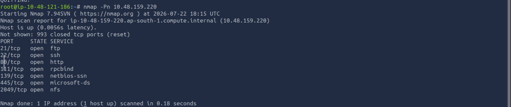
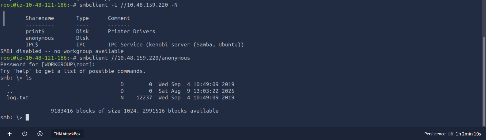
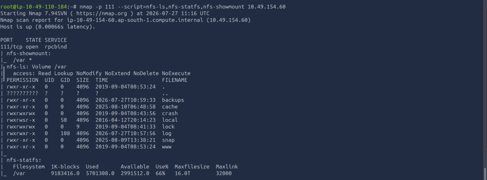
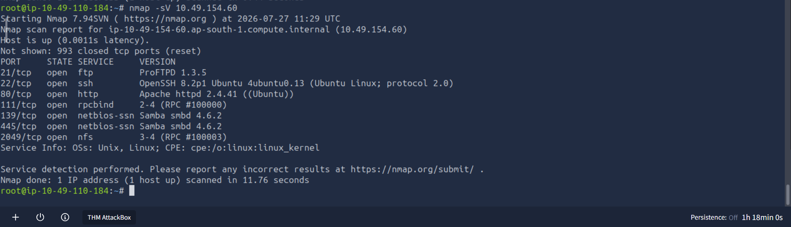
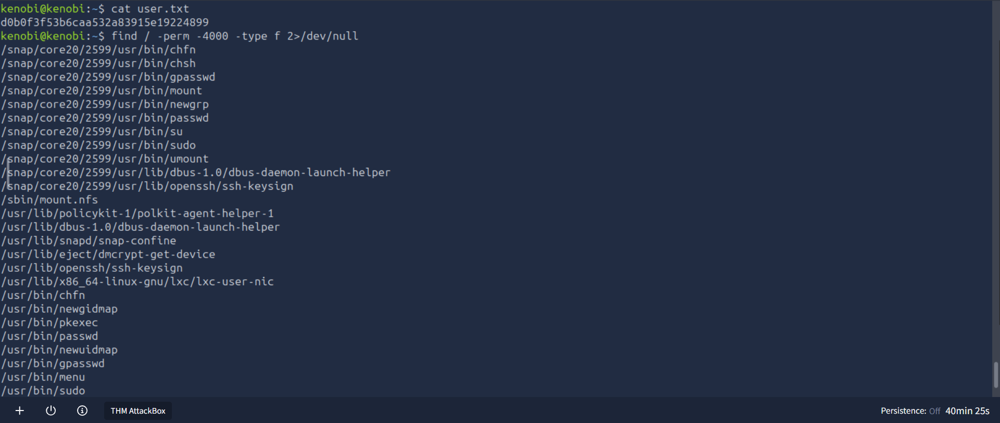
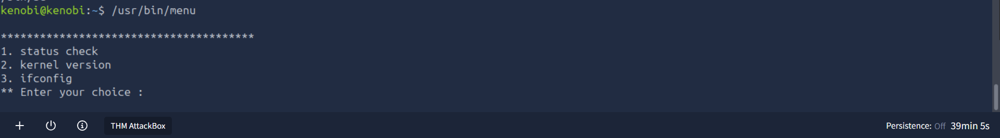

# Kenobi Penetration Testing Report
## Executive Summary
This report documents the assessment of the TryHackMe Kenobi room.
The objective was to identify vulnerabilities, gain initial access,
escalate privileges, and document the findings.

## Scope
- Target: TryHackMe Kenobi
- Platform: TryHackMe
- Difficulty: Easy

## Reconnaissance
### Nmap scan
An initial Nmap scan was performed to identify open ports and running services.
**Command:**

 ```bash
 nmap -Pn <TARGET_IP>
 ```

 ### Open ports
|PORT  |    STATE |   SERVICE         |
|------|----------|-------------------|
|21    |    open  |    ftp            |
|22    |    open  |    ssh            |
|80    |    open  |    http           |
|111   |    open  |    rpcbind        |
|139   |    open  |    netbios-ssn    |
|445   |    open  |    microsoft-ds   |
|2049  |     open |    nfs            |

 **Screenshot.**
 
 
 ### Analysis
 The initial Nmap scan identified seven
 open ports on the target system.The 
 presence of FTP,SSH,HTTP,SMB(NetBIOS/
 Microsoft-DS), RPCBind, and NFS suggested 
 multiple services that required further enumeration.
 SMB and NFS were identified as high-priority targets
 because they commonly expose shared resources that may
 lead to initial access.

## Enumeration
### SMB Enumeration
**Objective**
Enumerate available SMB shares and gather information
about the target.
**Command**
```bash
smbclient -L //<TARGET_IP> -N
```
### Available SMB Shares

|	Sharename   |   Type    | Comment                                      |
|-------------|-----------|----------------------------------------------|
|	print$      |    Disk   |   Printer Drivers                            |
|	anonymous   |    Disk   |                                              |
|	IPC$        |   IPC     |  IPC Service (kenobi server (Samba, Ubuntu)) |

**Screenshot:**


**Analysis:**
Three SMB shares were identified during
enumeration. The **anonymous** share was 
of particular interest because it may allow 
unauthenticated access to files that could reveal
sensitive information or assist in obtaining
initial access.
### Accessing the Anonymous share
The anonymous SMB share was accessed without 
authentication to identify any publicly accessible files.
**Command:**
```bash
smbclient //<TARGET_IP>/anonymous -N
```
### Files Discovered
log.txt file was discovered, this log file 
contain information that may assist in further enumeration
and exploitation.

### Analysis
The `anonymous` share allowed unauthenticated access. During 
enumeration, a file named `log.txt` was discovered. Log files often
contain configuration details, usernames, file paths, or other information
that can help identify a path to initial access.

### NFS Enumeration
**Objective**
Identify NFS exports that may expose sensitive directories or files accessible without authentication.
**Command**
```bash
showmount -e <TARGET_IP>
nmap -p 445 --script=smb-enum-shares.nse,smb-enum-users.nse <TARDET_IP>
```
**Screenshot:**

## Initial Access

### Gaining Initial Acess-ProFTPD
**Objective**
Investigate the FTP service for known vulnerabilities that can be used to gain initial access to the target system.
**Command**
```bash
nmap -sV <TARGET_IP>
```
**Screenshot:**


### Analysis
The target is running ProFTPD 1.3.5.This version may have the mod_copy module enabled, which allows attackers to copy files on the server without authentication.
If exploitable, this can be used to move sensitive files such as SSH keys into accessible locations.

### Security Impact 
An exposed and vulnerable FTP service can allow unauthorized access to sensitive files, leading to initial compromise of the target system.
## Privilege Escalation
### Privilege Escalation Enumeration
**Objective**
Identify misconfigured SUID binaries that can be abused to escalate privileges.
**Command**
```bash
find / -perm -4000 -type f 2>/dev/null
```
Further Analysis
  strings /usr/bin/menu
**Screenshots**



## Findings

The SUID binary executes the following commands without specifying their full paths:

   ------------
   |Curl      |
   ------------
   |uname     |
   ------------
   |ifconfig  |
   ------------
## Security Impact
Because the binary searches for these commands using the user's PATH,an attacker can place a maalicious executable earlier in the PATH and have it executed with root privileges.

## Flags Obtained

## User Flag

## Root Flag

## Recommendations 
- Keep software updated.
- Apply the principle of least privilege.
- Disable unnecessary services.
- Regularly review system configurations.

  ## Conclusion
  This room provided practical experience
  in reconnaissance, service enumeration,
  explotation, and linux privilege escalation.
