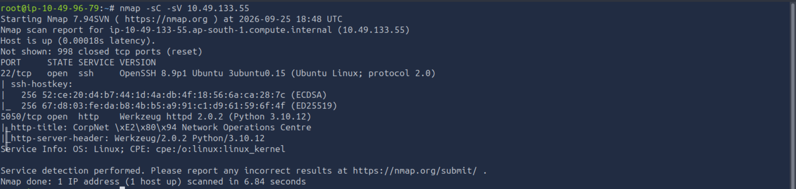
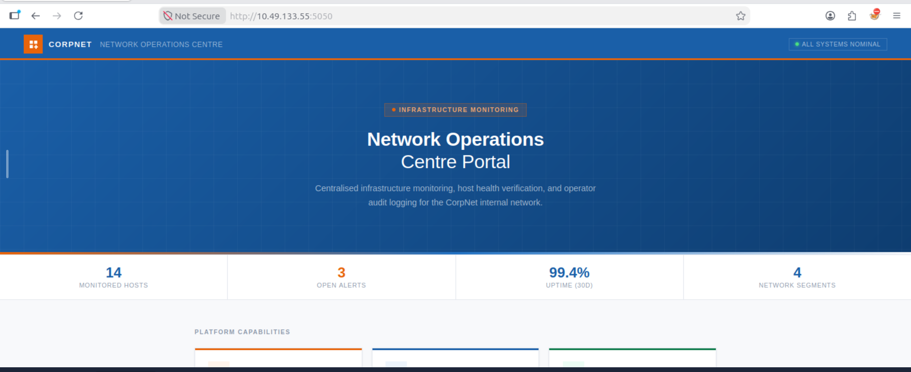
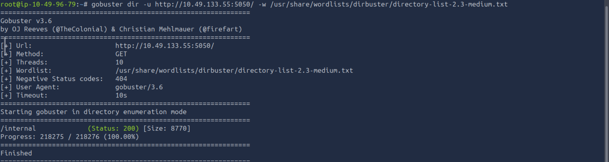
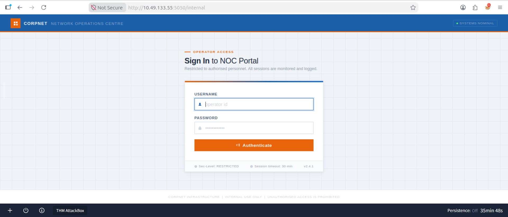
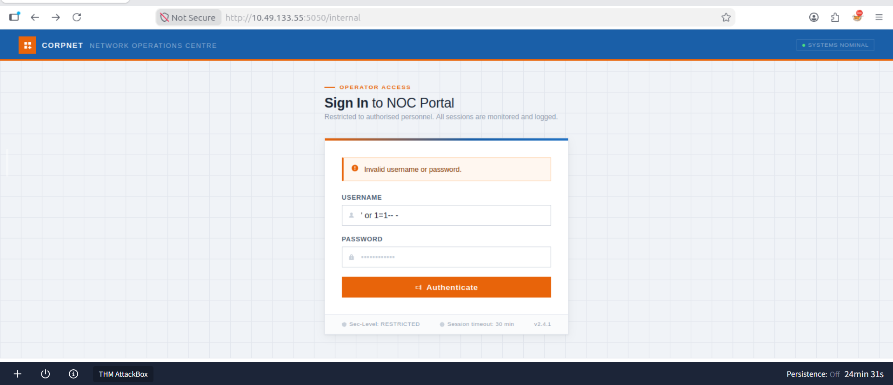
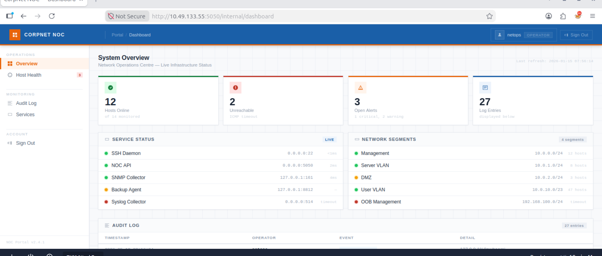
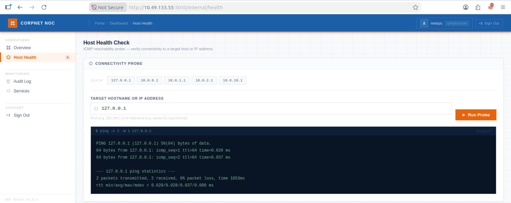

# Silent Monitor

## 1. Introduction
## 2. Reconnaissance
I did Nmap scan on the target to identify the open ports, services running and their versions.

```bash
   nmap -sC -sV 10.49.133.55
```



From the scan I found out that two ports were open :

 1. 22/tcp ssh OpenSSH 8.9p1 Ubuntu 3ubuntu0.15 (Ubuntu Linux; protocol 2.0)
  
 2. 5050/tcp http Werkzeug httpd 2.0.2 (Python 3.10.12)


## 3. Enumeration
### Web Enumeration
I looked into the web on port 5050 and found out that NOC Portal v2.4.1 is running.



### Directory Enumeration

I ran Gobuster to identify directories and files on a website.

```bash
 gobuster dir -u http://10.49.133.55:5050/ -w /usr/share/wordlists/dirbuster/directory-list-2.3-medium.txt
```
I found out /internal directory.



I tried to access the directory from the web:



## 4. Vulnerability Identification

Once I have accessed the web directory, I tried to login using default credentials :

  admin : admin 

  user : user 

without success, I decided to try SQL Injection instead.




## 5. Initial Access
By using SQL Injection vulnerability on the website I was able to successfully login into the portal and obtained the account netops with the role of operator.



I took sometime to understand the web and found different features and information, including Host Health that I assume was used to run ping to the hosts to verify their reachability through ICMP packets. Also I found Audit log and services under monitoring where I found information about the logs and users who had been logged (jmartin, svc-mon,,,) and the Ip adresses.



## 6. Privilege Escalation
## 7. Evidence
## 8. Findings
## 9. Lessons Learned
## 10. Conclusion
