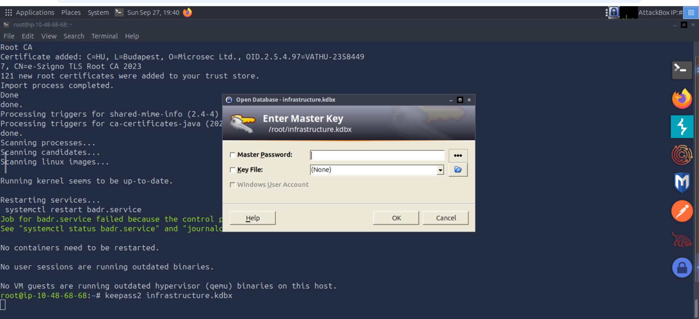

# Silent Monitor

## 1. Introduction

CorpNet's internal network operations centre has been running quietly for years. Monitoring hosts, logging events, and keeping the infrastructure alive. Or so it seems. A tip from a disgruntled contractor suggests that someone on the NOC team has been cutting corners, leaving doors open, and hiding things in places no one thinks to look.

## 2. Reconnaissance
I did Nmap scan on the target to identify the open ports, services running and their versions.

```bash
   nmap -sC -sV 10.49.133.55
```


From the scan I found out that two ports were open :

 1. 22/tcp ssh OpenSSH 8.9p1 Ubuntu 3ubuntu0.15 (Ubuntu Linux; protocol 2.0)
  
 2. 5050/tcp http Werkzeug httpd 2.0.2 (Python 3.10.12)


## 3. Enumeration
### Web Enumeration
I looked into the web on port 5050 and found out that NOC Portal v2.4.1 is running.


### Directory Enumeration

I ran Gobuster to identify directories and files on a website.

```bash
 gobuster dir -u http://10.49.133.55:5050/ -w /usr/share/wordlists/dirbuster/directory-list-2.3-medium.txt
```
I found out /internal directory.


I tried to access the directory from the web:


## 4. Vulnerability Identification

Once I have accessed the web directory, I tried to login using default credentials :

  admin : admin 

  user : user 

without success, I decided to try SQL Injection instead.


## 5. Initial Access
By using SQL Injection vulnerability on the website I was able to successfully login into the portal and obtained the account netops with the role of operator.


I took sometime to understand the web and found different features and information, including Host Health that I assume was used to run ping to the hosts to verify their reachability through ICMP packets. Also I found Audit log and services under monitoring where I found information about the logs and users who had been logged (jmartin, svc-mon,,,) and the Ip adresses.


I used Burp Suite to capture the request, then added &ls after target=127.0.0.1 in the POST request to try listing the files in the current directory, but it did not work.


After several tests, I found that adding %0als successfully displayed the files in the current folder.


%0a is the URL-encoded form of the newline character \n, a newline can separate commands, causing the backend to treat the input as two lines and potentially enabling command injection.
%00: Represents a null byte, which in some older parsing behaviors may terminate a string early and prevent the rest of the input from being processed normally.

From it we were able to see some files like secret.config, which appears to store very important information. Therefore, we modified the POST request from target=127.0.0.1%0als to target=127.0.0.1%0acat%00secret.config in order to read the contents of secret.config.


I was now able to get the sysadmin username and the password required to sign in.

At the beginning there was ssh port open, I tried to login into the server with the found username and password.

```bash
   ssh sysadmin@10.48.186.84
```


I was able to login and found the first flag.

## 6. Privilege Escalation

Now I need to read a file named root.txt, but it cannot be read directly using the sysadmin account, so we need a higher-privileged account. I checked the contents of backups and I  found README.txt and infrastructure.kdbx.
After opening README.txt, it explained that infrastructure.kdbx is a KeePass credential database used to store credentials. This suggests that if I can open this database, I may be able to obtain information for a more privileged account.


Explanation:

root.txt: A file commonly used in CTFs or penetration tests to represent the root-level flag, usually readable only by privileged users.
infrastructure.kdbx: A KeePass database file used to store sensitive information such as usernames, passwords, and private keys.

I used the scp command to download the infrastructure.kdbx file on a new terminal.

```bash
   scp sysadmin@10.48.186.84:backups/infrastructure.kdbx .
```

Opening infrastructure.kdbx requires a password, which we do not have. Therefore, we need to crack the correct password before we can successfully open the database.



Can use keepass4crack.py to crack the password of infrastructure.kdbx .

```bash
  python3 keepass4crack.py ../infrastructure.kdbx /usr/share/wordlists/rockyou.tx
```

The password was successfully found to be spring.

We then used the this command again to open infrastructure.kdbx

```bash
   keepass2 infrastructure.kdbx
```

Next, I switched back to the SSH terminal and ran the su - root command, then entered the password we had found earlier. This successfully logged us in as root. After that, running ls -la allowed us to see the root.txt file, and cat root.txt was used to read its contents

## 7. Lessons Learned

Lessons Learned

Completing the Silent Monitor room reinforced several important practical cybersecurity concepts.

### 1. Enumeration is critical

The initial enumeration phase is essential for understanding the target environment. Identifying exposed services and technologies helps determine where further investigation should be focused.

### 2. Don't rely on a single attack path

A target may expose multiple services or potential entry points. I learned the importance of investigating findings systematically rather than immediately focusing on the first potential vulnerability.

### 3. Understand what the tools are telling you

Tools such as Nmap and web enumeration utilities provide valuable information, but the output still needs to be interpreted. Understanding why a result matters is more important than simply running the command.

### 4. Follow the evidence

Each discovery should lead to the next logical step. Information gathered during enumeration can reveal usernames, technologies, directories, services, permissions, or other clues that help build an attack path.

### 5. Privilege escalation requires careful enumeration

After gaining an initial foothold, the work is not necessarily finished. Checking the system, users, permissions, running processes, files, and available privileges can reveal opportunities for moving toward higher privileges.

### 6. Troubleshooting is part of penetration testing

Not every command or technique works on the first attempt. The room reinforced the importance of understanding errors, checking assumptions, and adapting the approach instead of blindly repeating commands.

### 7. Documentation matters

Recording commands, findings, screenshots, and explanations makes the process reproducible and helps me understand what I actually learned. It also turns individual labs into evidence of practical cybersecurity experience.

## Overall takeaway

Silent Monitor helped me strengthen my methodology: enumerate → analyze → investigate → exploit where appropriate → escalate privileges → document the findings.

The biggest lesson is that penetration testing is not just about knowing tools or commands. It is about understanding the information collected and using it to make logical decisions throughout the assessment.

