# Silent Monitor

## 1. Introduction
## 2. Reconnaissance
I did Nmap scan on the target to identify the open ports, services running and their versions.

```bash
   nmap -sC -sV 10.49.133.55
```

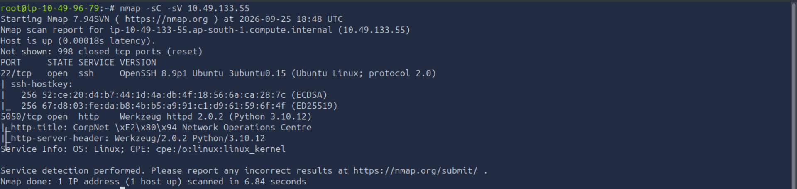

From the scan I found out that two ports were open :

 1. 22/tcp ssh OpenSSH 8.9p1 Ubuntu 3ubuntu0.15 (Ubuntu Linux; protocol 2.0)
  
 2. 5050/tcp http Werkzeug httpd 2.0.2 (Python 3.10.12)


## 3. Enumeration
### Web Enumeration
I looked into the web on port 5050 and found out that NOC Portal v2.4.1 is running.

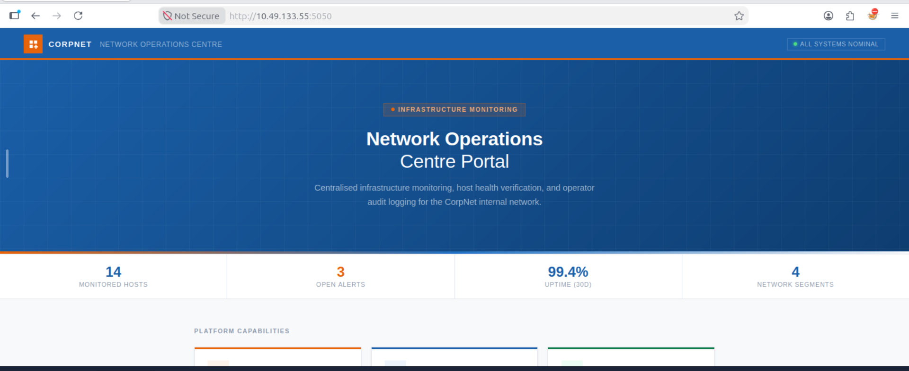

### Directory Enumeration

I ran Gobuster to identify directories and files on a website.

```bash
 gobuster dir -u http://10.49.133.55:5050/ -w /usr/share/wordlists/dirbuster/directory-list-2.3-medium.txt
```
I found out /internal directory.

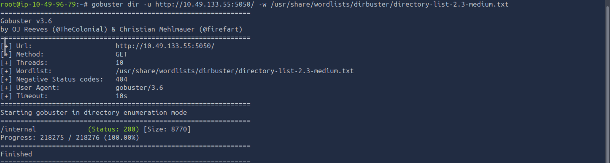

I tried to access the directory from the web:

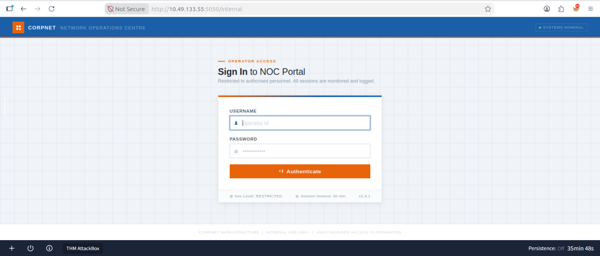

## 4. Vulnerability Identification

Once I have accessed the web directory, I tried to login using default credentials :

  admin : admin 

  user : user 

without success, I decided to try SQL Injection instead.

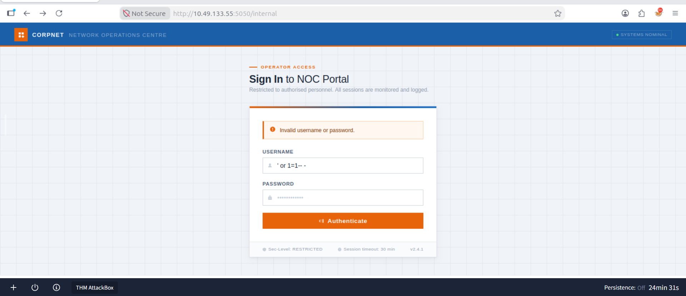


## 5. Initial Access
By using SQL Injection vulnerability on the website I was able to successfully login into the portal and obtained the account netops with the role of operator.

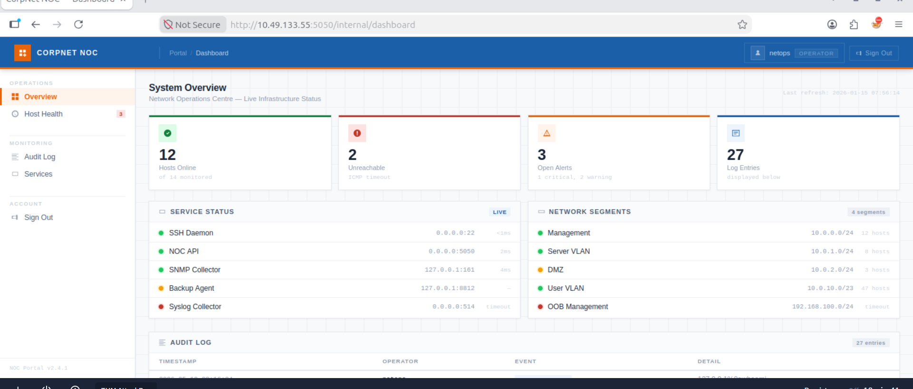

I took sometime to understand the web and found different features and information, including Host Health that I assume was used to run ping to the hosts to verify their reachability through ICMP packets. Also I found Audit log and services under monitoring where I found information about the logs and users who had been logged (jmartin, svc-mon,,,) and the Ip adresses.

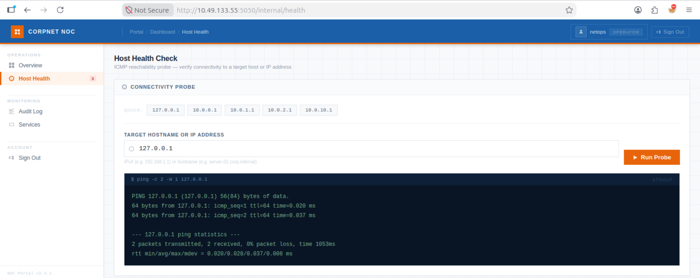

I used Burp Suite to capture the request, then added &ls after target=127.0.0.1 in the POST request to try listing the files in the current directory, but it did not work.

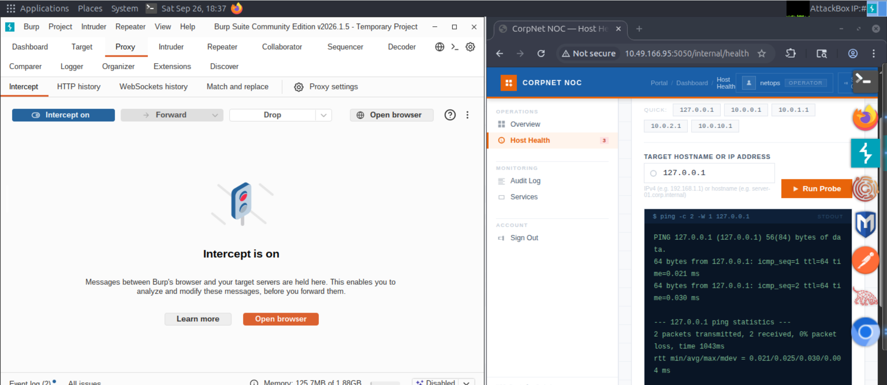


After several tests, I found that adding %0als successfully displayed the files in the current folder.


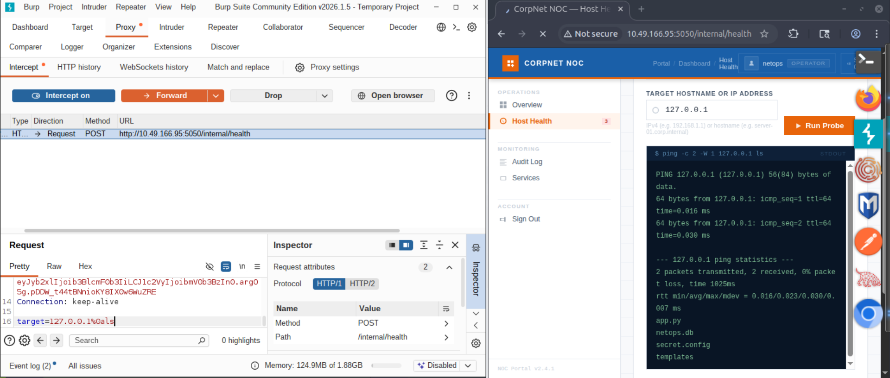


%0a is the URL-encoded form of the newline character \n, a newline can separate commands, causing the backend to treat the input as two lines and potentially enabling command injection.
%00: Represents a null byte, which in some older parsing behaviors may terminate a string early and prevent the rest of the input from being processed normally.

From it we were able to see some files like secret.config, which appears to store very important information. Therefore, we modified the POST request from target=127.0.0.1%0als to target=127.0.0.1%0acat%00secret.config in order to read the contents of secret.config.

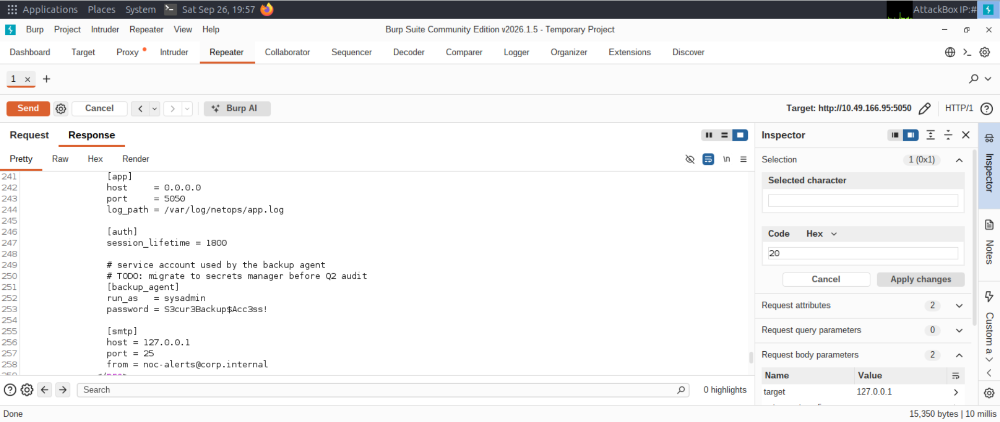

I was now able to get the sysadmin username and the password required to sign in.

At the beginning there was ssh port open, I tried to login into the server with the found username and password.

```bash
   ssh sysadmin@10.48.186.84
```

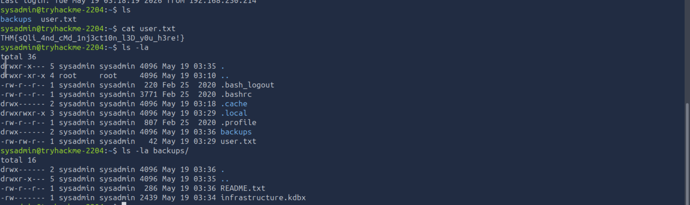

I was able to login and found the first flag.

## 6. Privilege Escalation

Now I need to read a file named root.txt, but it cannot be read directly using the sysadmin account, so we need a higher-privileged account. I checked the contents of backups and I  found README.txt and infrastructure.kdbx.
After opening README.txt, it explained that infrastructure.kdbx is a KeePass credential database used to store credentials. This suggests that if I can open this database, I may be able to obtain information for a more privileged account.

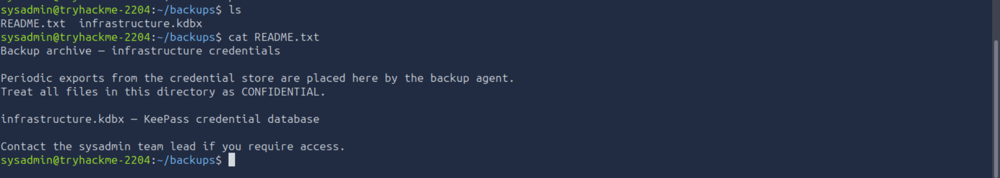

    
## 7. Evidence
## 8. Findings
## 9. Lessons Learned
## 10. Conclusion
